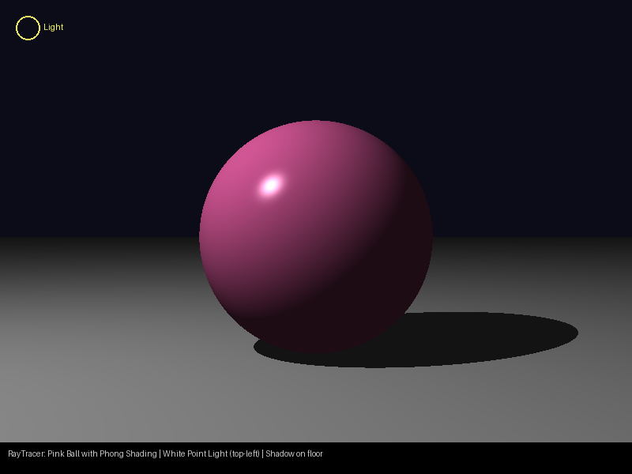

# RayTracer

A CPU ray tracer implemented as a native **macOS SwiftUI** application with no external dependencies.



## What it does

Renders a fixed scene using the **Phong reflection model**:

| Object | Details |
|--------|---------|
| Pink sphere | Center `(0, 0, 0)`, radius 1, hot-pink `(1.0, 0.41, 0.71)`, shininess 64 |
| Grey floor plane | `y = −1`; the ball rests on it and casts a shadow onto it |
| White point light | Position `(−3.5, 4.0, −3.0)` — top-left, in front of the ball |
| Camera | Position `(0, 0, −5)`, 45° vertical FoV, looking along +Z |

The Phong illumination equation used is:

```
I = ka·La  +  kd·(N·L)·lightColor  +  ks·(R·V)ⁿ·lightColor
```

Points occluded from the light (shadow test) receive only the ambient term.  
Output resolution is **800 × 600** pixels. Rendering runs off the main thread; a spinner is shown until the image is ready.

## Project structure

```
RayTracer/
├── Package.swift                      # SPM package (macOS 13+)
└── Sources/RayTracer/
    ├── Math.swift                     # Vec3, Ray
    ├── Scene.swift                    # Material, PointLight, Sphere, Plane, Scene
    ├── Renderer.swift                 # phongShading(), RayTracer (camera + pixel loop)
    ├── ContentView.swift              # SwiftUI view — async render, spinner
    └── RayTracerApp.swift             # @main App entry, 800×600 window
```

## Requirements

- macOS 13 Ventura or later
- Xcode 15+ **or** Swift 5.9+ toolchain (for command-line builds)

## How to run

### Xcode

1. Open the `RayTracer` folder in Xcode (`File › Open…` and select the folder — Xcode detects the `Package.swift` automatically).
2. Select the **RayTracer** scheme and any Mac destination.
3. Press **⌘R** to build and run. The window opens and displays the rendered image once tracing completes.

### Command line (Swift Package Manager)

```bash
cd RayTracer
swift run
```

The app window will open via the SwiftUI app lifecycle — no extra flags are required.

> **Note:** Because this is a SwiftUI app, it must be run on macOS directly (not via SSH without a display).
